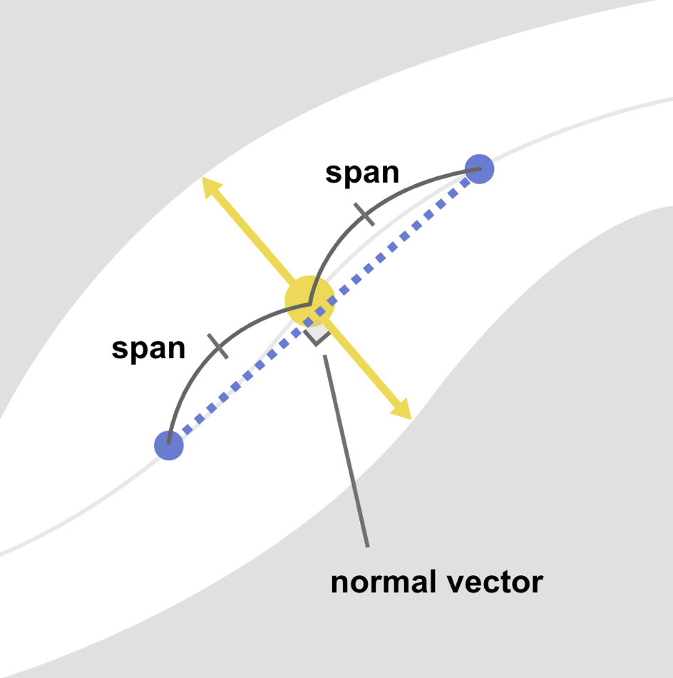
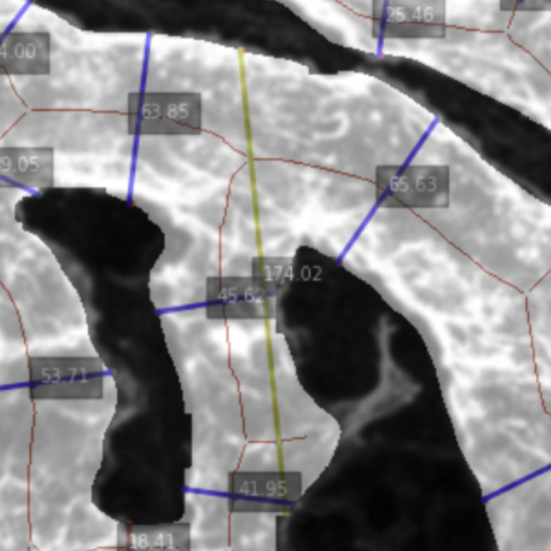

# PAVSAT: Python based Auto Vessel Segmentation Analysis Tool

## Overview

This tool performs automated analysis of blood vessel images using segmentation models. It processes images according to user-defined parameters and outputs vessel measurements and statistics.

## Requirements

### Input Files

Users must prepare the following file:

### `input_sample_data.csv` (default filename, customizable)

A CSV file containing the list of images to be analyzed with the following columns:

- **`raw_sample_path`**: Path to the raw image file
- **`condition`**: Experimental or sample condition identifier
- **`magnification`**: Conversion factor for mm/pixel
    - ⚠️ **Note**: Users must determine this value based on their imaging setup

## Configuration Parameters

### Analysis Parameters (Individual Settings)

| Parameter | Property Name | Description | Category |
| --- | --- | --- | --- |
| **Tangent Calculation Range** | `self.range` | Length of reference line segment used for tangent line calculation(image2)| Individual Setting |
| **Tile Size** | `self.span` | Size of square tiles for image subdivision (pixels)(image1) | Individual Setting |

image1: Calculation Method



### Filtering Parameters (Quality Control)

| Parameter | Property Name | Description | Category |
| --- | --- | --- | --- |
| **Minimum Vessel Length** | `self.min_length_percentage` | Minimum vessel length as percentage of image width | Filtering |
| **Maximum Vessel Length** | `self.max_length_percentage` | Maximum vessel length as percentage of image width | Filtering |
| **Width Ratio Tolerance** | `self.distance_ratio` | Maximum allowable ratio between left and right side widths(image2) | Filtering |
| **Diameter Variance Threshold** | `self.variance_threshold` | Maximum allowable variance in vessel diameter (variability rate) | Filtering |

image2: Inappropriate Width Ratio Example


### General Settings

| Parameter | Property Name | Description | Category |
| --- | --- | --- | --- |
| **Segmentation Model Path** | `self.model` | Path to the segmentation model file | Settings (Default) |
| **Input CSV Path** | `self.input_csv_path` | Path to the image list CSV file | Settings |
| **Output Directory** | `self.output_path` | Directory path for output files | Settings |
| **Project Name** | `self.project` | Project name (creates a subdirectory) | Settings |

## Usage Instructions

### Step 1: Prepare Input CSV

Create an image list CSV file (`input_sample_data.csv`) with the required columns:

```
raw_sample_path,condition,magnification
/path/to/image1.png,control,0.0025
/path/to/image2.png,treatment,0.0025

```

### Step 2: Run the Application

Execute the following command:

```bash
git clone https://github.com/R3ishida/PAVSAT
cd PAVSAT
python code/main.py

```

### Step 3: Configure Parameters

A configuration window will appear. Enter the following settings:

### Individual Settings

1. **Tangent Line Reference Length**
    - Length of the reference line segment for tangent calculation
    - 💡 *Tip: Default value is generally suitable for most cases*
2. **Image Tile Size**
    - Size of square tiles for subdividing images during analysis
    - Images are processed in tiles of this dimension

### Filtering Settings (Quality Control)

Configure quality control parameters for analyzed vessels:

1. **Vessel Length Constraints** (as percentage of image width)
    - **Minimum value**: Lower bound for acceptable vessel length
    - **Maximum value**: Upper bound for acceptable vessel length
2. **Diameter Symmetry Tolerance**
    - Maximum allowable difference between left and right side widths from the vessel centerline
    - Set the maximum acceptable value
3. **Diameter Variance Threshold**
    - Maximum allowable variance in diameter measurements along the same vessel
    - Set the maximum acceptable variability rate

### General Settings

1. **Output Directory**
    - Destination folder for analysis results
2. **Project Name**
    - Name for the analysis project (creates a dedicated subdirectory)
3. **Image List CSV Path**
    - Path to the input CSV file containing image information
4. **Segmentation Model Path**
    - Path to the segmentation model file
    - 💡 *Tip: Default value is generally suitable for most cases*

## Output

Analysis results will be saved in the specified output directory under a subdirectory named with your project name. The output typically includes:

- Processed vessel measurements
- Filtered vessel data based on quality control parameters
- Visualization files (if applicable)
- Summary statistics

## Notes

- Ensure all image paths in the CSV are accessible from the execution environment
- The magnification value must be accurately determined for correct measurements
- Filtering parameters can be adjusted iteratively to optimize results for your specific dataset
- Image subdivision (tiling) helps process large images efficiently

## Troubleshooting

- If the model path is invalid, the application will fail to initialize
- Ensure CSV format matches the expected column structure
- Check that image files exist at the specified paths
- Verify that the output directory has write permissions